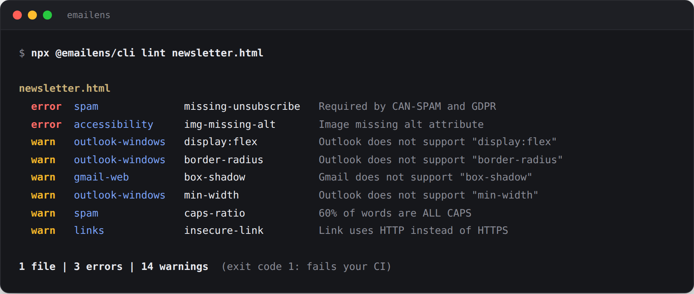

<div align="center">

<picture>
  <source media="(prefers-color-scheme: dark)" srcset="./docs/wordmark-dark.svg">
  
</picture>

**The rendering linter for email, in your terminal**

[](https://github.com/emailens/cli/actions/workflows/ci.yml)
[](https://www.npmjs.com/package/@emailens/cli)
[](https://github.com/emailens/mcp)
[](https://github.com/emailens/cli/stargazers)

</div>

CLI tool for email compatibility analysis — preview how your emails render across 21 email clients (Gmail, Outlook, Apple Mail, Yahoo, Samsung, Thunderbird, HEY, Proton Mail, AOL, Fastmail, Superhuman).

Point it at **HTML, MJML, Maizzle or React Email**. The format is detected from the file extension, the template is compiled with your project's own compiler, and what gets linted is the HTML your readers actually receive.

Across the 255 CSS and HTML features we track, only 6 are fully supported in every major client ([see the data](https://emailens.dev/email-css/report)). This tool catches the other 249 before your users do.



> **Prefer AI?** Use the [MCP server](https://github.com/emailens/mcp) — same engine, works with Claude, Cursor, and any MCP client.

## Install

```bash
npm install -g @emailens/cli
```

Or use with npx:

```bash
npx @emailens/cli analyze email.html
```

## Commands

### `emailens analyze <file>`

Analyze CSS compatibility and get per-client scores.

```bash
emailens analyze email.html
emailens analyze email.html --clients gmail-web,outlook-windows
emailens analyze email.html --json
cat email.html | emailens analyze -
```

Warnings show where the property is used, and how many other places share the
problem:

```
  ⚠ Outlook (New) (1 issue)
    ⚠ border-radius (4:8 +2 more) — Outlook (New) does not support "border-radius".
```

`--json` carries the full `loc` / `locs` for each warning. As with `lint`,
positions are reported for HTML input only — see below.

### `emailens preview <file>`

Full preview pipeline: transforms, analysis, dark mode simulation, and optional screenshots.

```bash
emailens preview email.html
emailens preview email.html --dark-mode
emailens preview email.html --screenshots --out ./screenshots
emailens preview email.html --json
```

### `emailens export <file>`

Export a self-contained HTML or JSON report.

```bash
emailens export email.html -o ./report
emailens export email.html --json -o ./report
emailens export email.html --dark-mode --screenshots -o ./report
```

### `emailens fix <file>`

Generate AI-powered fixes for email compatibility issues. Uses `@emailens/engine` analysis to build a structured prompt, then calls Claude to fix structural issues (table layouts, VML, MSO conditionals) that static snippets can't handle.

Requires `ANTHROPIC_API_KEY` environment variable and the optional `@anthropic-ai/sdk` dependency.

```bash
emailens fix email.html                           # Fix and print to stdout
emailens fix email.html -o fixed.html             # Write to file
emailens fix email.html --estimate                 # Show token estimate only (no AI call)
emailens fix email.html --clients outlook-windows  # Scope to one client
emailens fix email.html --json                     # Full JSON output with metadata
emailens fix email.html --max-tokens 8000          # Limit prompt size
cat email.html | emailens fix - --format jsx       # Pipe from stdin
```

| Flag | Alias | Description |
|------|-------|-------------|
| `--format` | `-f` | Input format: `html`, `jsx`, `mjml`, `maizzle` |
| `--clients` | `-c` | Comma-separated client IDs to scope the fix |
| `--output` | `-o` | Write fixed code to file instead of stdout |
| `--json` | | Output as JSON (includes token estimates and metadata) |
| `--quiet` | `-q` | Suppress spinners and decorations |
| `--estimate` | | Only show token estimate without calling the AI |
| `--max-tokens` | | Maximum input tokens for the prompt (default: 16000) |

### `emailens lint <file|glob>`

CI/CD-friendly linting with structured exit codes. Flattens all audit checks (compatibility, content hygiene, links, accessibility, images, inbox preview, size, template variables, content overflow, visual bugs) into a unified issue list.

```bash
emailens lint email.html
emailens lint src/*.html
emailens lint email.html --json
emailens lint email.html --fail-on-warning
emailens lint email.html --skip spam,links
emailens lint email.html --max-warnings 5
```

| Flag | Alias | Description |
|------|-------|-------------|
| `--format` | `-f` | Input format: `html`, `jsx`, `mjml`, `maizzle` |
| `--json` | | Output as JSON |
| `--fail-on-warning` | | Exit 2 if warnings found |
| `--skip` | | Comma-separated checks to skip: `spam,links,accessibility,images,compatibility,inboxPreview,size,templateVariables,overflow,visual` |
| `--max-warnings` | | Fail if more than n warnings |

**Exit codes:**
- `0` — clean
- `1` — errors found
- `2` — warnings only (with `--fail-on-warning` or `--max-warnings` exceeded)

**Output format:**

```
src/emails/welcome.html
  error  12:8  outlook-windows     border-radius           Not supported in Outlook Windows
  warn         spam                caps-ratio              20%+ of words are ALL CAPS

src/emails/newsletter.html
  pass   No issues found

2 files | 1 error | 1 warning
```

Issues that belong to a specific place in the file carry a `line:col`; findings
about the document as a whole (spam signals, Gmail clipping, inbox preview) have
no position and leave the column blank. With `--json`, each issue carries a
`loc` object instead — `line`, `column`, `endLine`, `endColumn`, `offset`,
`length` — for editors, annotations, and agents that need to point at or edit
the exact source.

One property can break in many places, so CSS issues also carry `locs`: every
occurrence in document order, with `loc` as the first, and `locsTruncated: true`
when there were more than 100.

Positions are reported for **HTML sources only**. JSX, MJML and Maizzle are
compiled before analysis, so a line number would refer to generated output
rather than the file you wrote; the CLI omits it rather than print one that
looks authoritative and isn't.

#### CI / GitHub Actions

Drop this into `.github/workflows/email-lint.yml` to fail PRs that introduce broken email CSS, spam triggers, or accessibility regressions:

```yaml
name: Email lint

on:
  pull_request:
    paths:
      - 'emails/**'
      - 'src/emails/**'

jobs:
  lint:
    runs-on: ubuntu-latest
    steps:
      - uses: actions/checkout@v4
      - uses: actions/setup-node@v4
        with:
          node-version: 22
      - name: Lint emails
        run: npx -y @emailens/cli lint 'emails/**/*.{html,tsx,mjml}' --fail-on-warning
```

For React Email / MJML / Maizzle source files, the CLI auto-detects the format from the extension. Want full preview reports (with screenshots and shareable links) on every PR? Use the [Emailens GitHub Action](https://github.com/marketplace/actions/emailens-email-preview-check) instead — it wraps the same engine.

### `emailens clients`

List all 21 supported email clients.

```bash
emailens clients
emailens clients --json
```

## Options

All file-processing commands share:

| Flag | Alias | Description |
|------|-------|-------------|
| `--format` | `-f` | Input format: `html`, `jsx`, `mjml`, `maizzle` |
| `--clients` | `-c` | Comma-separated client IDs to filter |
| `--json` | | Output JSON instead of terminal table |
| `--quiet` | `-q` | Suppress spinners and decorations |

Preview and export add:

| Flag | Alias | Description |
|------|-------|-------------|
| `--dark-mode` | `-d` | Include dark mode simulation |
| `--screenshots` | | Capture screenshots (requires `BROWSERLESS_URL`) |
| `--out` | `-o` | Output directory |

## AI Fixes

The `fix` command requires an `ANTHROPIC_API_KEY` environment variable and the `@anthropic-ai/sdk` package:

```bash
npm install @anthropic-ai/sdk
export ANTHROPIC_API_KEY=sk-ant-...
```

Use `--estimate` to check token usage before making an API call:

```bash
emailens fix email.html --estimate
#   Input tokens:    ~4,200
#   Output tokens:   ~5,400
#   Warnings:        23 (5 structural)
```

## Framework Support

The CLI can compile React Email (JSX/TSX), MJML, and Maizzle templates to HTML before analysis. Format is auto-detected from file extension, or specify with `--format`.

```bash
emailens analyze newsletter.tsx              # Auto-detected as JSX
emailens analyze template.mjml               # Auto-detected as MJML
emailens preview email.html --format maizzle # Explicit format
```

Framework compilers are optional peer dependencies — install only what you need:

```bash
npm install sucrase react @react-email/components @react-email/render  # For JSX
npm install mjml                                                        # For MJML
npm install @maizzle/framework                                          # For Maizzle
```

## Screenshots

Screenshots require a [Browserless](https://www.browserless.io/) instance and `playwright-core`:

```bash
npm install playwright-core
export BROWSERLESS_URL=ws://localhost:3000
emailens preview email.html --screenshots --out ./screenshots
```

## Piping

Read from stdin with `-`:

```bash
cat email.html | emailens analyze -
echo '<html><body>Hello</body></html>' | emailens preview - --json
```

## License

MIT

---

If this saved you from an Outlook surprise, [a star](https://github.com/emailens/cli) helps other email developers find it.
